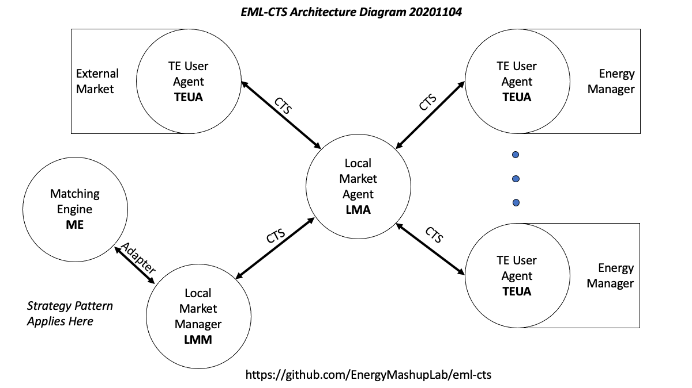

<h1 align="center">
   
  
   
Energy Mashup Lab Common Transactive Services
     
   
    EML-CTS
   
</h1>

  <a href="#background">Background</a> •
  <a href="#tech-desc">Technical Description</a> •
  <a href="docs/README.md">Documentation</a> •
  <a href="#authors">Authors</a> •
  <a href="#license">License</a>

We invite participation in this open source project to create Actors[1](#fn1) for
edge-based self-optimization of power distribution systems.

This project is named
EML-CTS because it is an implementation by The Energy Mashup Lab and others of an agent-based transactive energy 
market using the Common Transactive Services defined during the NIST Transactive 
Energy Challenge and refined during this project.

Background
----------

Transactive Resource Management (TRM) enables Actors representing systems that
use or supply a resource—any commodity whose value is defined by time and
delivery location— to coordinate behaviors without the need for central control.
TRM-based systems engage Actors in markets to manage supply and demand of a
resource over time. Markets enable emergent behavior—new behavior related to
actors and relationships as actors meet their internal needs.

TRM systems are highly resilient, as Actors can join or leave the system without
additional integration. TRM applications include managing power distribution,
smart power grids, smart water, bandwidth sharing, placement of web and social
media ads, and wastewater management.

When the resource is electric power, TRM is called Transactive Energy (TE).
Transactive Energy is already used to manage the bulk power grid. TE is
considered essential to developing new resilient power grids, to transform
legacy power grids, and to build resource-constrained grids.

Actor-based architectures enable hyper-scalable applications that are easy to
design, build, and maintain. Actor Interactions are limited to defined messages,
so they support diversity of participants and technologies. Market transaction
messages create self-optimizing systems of suppliers, consumers, and
distribution.

This project will develop Transactive Energy User Agents (TEUA) interacting through
Markets. We will define interfaces between an energy system and the Actor (TEUA)
that represents it. TEUAs will interact with a Market Agent/Actor (MA) that
encapsulates market behavior. While the project uses a Bilateral Market model,
the Market Agent will incorporate a Market Modular Interface to support other
market models.

Bilateral Market is a classification; examples of bilateral markets include Double Auction and Order Book.

To see a description of the components that make up this project, look under the 
subfolders of the [source directory](complete/src) as well as the project wiki (in progress) and [documentation folder](complete/docs).

Results
-------

We expect that this project will make it easier for communities, facility
owners, and device makers to apply TE. For example, this project is being used in
simulations to model TE for regulators and legislators. A complete
implementation of the Common Transactive Services will be highly visible and
widely used.

Standards Used
--------------

The project uses standards including

-   The TEMIX profile of [OASIS Energy
    Interoperation](https://docs.oasis-open.org/energyinterop/ei/v1.0/os/energyinterop-v1.0-os.html).
    Energy Interoperation is the profile base of [OpenADR 2](https://www.openadr.org/) standardized as
    [IEC 62746-10-1](<https://webstore.iec.ch/publication/26267>)

-   Informative UML models for Energy Interoperation/CTS payloads as shown in
    the EI Standard

-   [ISO 17800 Facility Smart Grid Information Model](https://www.iso.org/standard/71547.html)

-   Adapter methods for integrating with Independent System Operator Wholesale
    Markets and other energy markets are based on [IEC 62746-10-3:2018](https://webstore.iec.ch/publication/59771)

Technical Description
---------------------

The EML-CTS Project is a standards-based implementation of the Common
Transactive Services using a Transactive Energy User Agenta (TEUA), a Local Market Agent (LMA) that facilitiates interaction between users
and local markets through a Local Market comprised of a Local Market Manager (LMM) which in turn connects with a matching engine (ME).
The  Architecture Diagram shows terminology and relationships within the implementation. 

The client/building/supervisory controller/external market/external microgrid, or *user* view is that each user engages with others through a local market by means of its respective Transactive Energy User Agent

The project has a number of components under [../dev](../dev ). The major components are

-   **Markets** including

    -   The Local Market Manager (LMM), the agent that fronts the market implementation including the matching engine that matches buy and sell tenders
    
    -   A bilateral market or matching engine (ME), ParityTrading in the current implementation
    
    -   (future) Additional markets

-   **Local Market Agent** (LMA) which interacts with the local market and with Transactive
    Energy User Agents and External Market Adapters using CTS messages. Functions include    
    -   Market Position Management (see note)
    
    -   A logical Ledger, the record of cleared (not pending) transactions (see note)
    
    -   Hook points for price Adjustments, enabling market economics experiments
    
    -   Uses CTS messages to connect to the LMM and TEUAs
    
    -   Links to external markets via the External Market Adapter (EMA)
    
-   **Transactive Energy [User] Agent** (TEUA) which interacts with the LMA and provides
    integration capabilities for device and facility management as well as external microgrids and/or markets
    
    -   Interacts through CTS messages
    
    -   Integrates with the Client/Supervisory Controller/User (Energy Manager on the diagram)
    
    -   With the LMA maintains the logical Ledger, the record of cleared (not pending) transactions (see note)
    
    -   Can provide information on committed market positions to the Client/SC (see note)
    -   Serves to connect an external market or microgrid, enabling two way communication to buy or sell
    -   A place for price adjustments or other integration modifications

-   **Utility Functions** include

    -   Logging (traces)
    
    -   Programs to build configuration files for the ParityTrading market client and ParityTrading system
    
Notes: 
A ledger is a list in time order of committed transactions. A position is cumulative committed transactions. A trace of messages includes transactions proposed but never cleared. Ledgers are saved to a file or possibly sent over a network connection as the design matures.

The Position Manager tracks completed (cleared) transactions (also contained in a logical ledger) to record committed market positions.
Market position information may be needed by a TEUA (on behalf of its user).

A TEUA can use market position to determine the difference between committed position and projected needs, simplifying the user's job. The TEUA may then transact only for what is needed to align current committed position with projected needs, tendering to buy or sell as appropriate.

All transactions and clearing flow through the LMA which updates the Market Position database for use by others.

Built With
----------

Agile programming and architecture are used.

Source code and builds are managed using Github, Maven, Java 8, JUnit, Apache Log4j2, Spring and Spring Boot.

Building and Running
-------

See the [documentation](docs/README.md) directory and the project Wiki (in the top navigation bar on github) for the tooling and development environments.

There are videos in progress for The Energy Mashup Lab's YouTube channel; links will be provided as those are published.

Authors
-------

-   **William Cox** - *Architecture and Project Lead* - [Cox Software Architects
    LLC](http://coxsoftwarearchitects.com/)

-   **Toby Considine –** *Architecture* – [TC9 Inc](http://www.tc9.com/)

See also the list of [contributors] who have contributed to this project.

License
-------

This project is licensed under the Apache 2.0 License, and is Copyright 2019-2021 The Energy Mashup Lab.

For incoming (contributed) licenses see https://github.com/EnergyMashupLab/EML_Licenses

Acknowledgments
---------------
We gratefully acknowledge support from 
- NIST, the National Institute of Standards and Technology, including David Holmberg and Thomas Roth
- The New Jersey Institute of Technology and the NJIT Capstone program where we worked with faculty and teams of Seniors and Masters students, specifically
  - Professor Osama Eljabiri 
  - Capstone Executive Team members for each term listed below
  - Team members Spring 2021 (listed alphabetically): Vishnu Nandan Chinta, Neha Jagtap, Krina Patel, Suvarna Patil, Devam Shah 
  - Team members Fall 2020 (listed alphabetically): Omair Abdul, Omar Janouk, Matthew Molinari
  - Team members Summer 2020 (listed alphabetically): Indira A. Akkiraju, Josiah Nieves, Alex Shepherd
  - Team members Spring 2020 (listed alphabetically): Matt Amato, Dhruvinkumar Desai, Anupam Saini, Justin Schuster
  - Team members Fall 2019 (listed alphabetically): Rajeev Chanchlan, Jasper Sam David, Mounica Gona, Dhrumil Shah, Karan Shah
- Officers and Members of The Energy Mashup Lab including
  - Toby Considine, William Cox

Footnotes
---------------

<a class="anchor" id="fn1">1)</a> The difference between Actors and Agents can be a fine one. The actor model of concurrent computation  treats "actor" as the universal primitive of concurrent computation. An actor is an intelligent resource that has the capacity to initiate, manage, and/or control activities of given types. In response to a message it receives, an actor can: make local decisions, create more actors, send more messages, and determine how to respond to the next message received. An Agent *may* be a particular instantiation of an Actor. Some distinguish the two by whether systems can share direct access to external data--to them, an Agent can and an Actor cannot. Perhaps the Market Matching Engine is an Actor and a component of the the Local Market which is an Agent. Similary, the TEUA may be an Actor which with the SC comprises the User Agent. 
This project does not wish to delve into these semantics, and generally uses the terms interchangeably.

